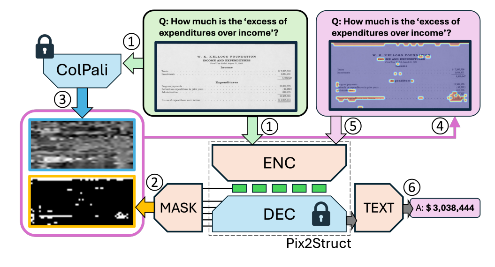

# DocVXQA
DocVXQA: Context-Aware Visual Explanations for Document Question Answering


## Table of Contents
- [DocVXQA](#docvxqa)
  - [Table of Contents](#table-of-contents)
  - [Description](#description)
  - [Installation](#installation)
  - [Usage](#usage)
    - [Download Weights](#download-weights)
    - [Demo](#demo)
    - [Training](#training)
    - [Evaluation](#evaluation)
  - [License](#license)
  - [Citation](#citation)

## Description 

<p align="center">
  
</p>

PyTorch implementation of our ICML 2025 paper [DocVXQA: Context-Aware Visual Explanations for Document Question Answering](https://icml.cc/virtual/2025/poster/43613). This model not only produces accurate answers to questions grounded in document images but also generates visual explanations — heatmaps that highlight semantically and contextually important regions, enabling interpretability in document understanding tasks.

## Installation
clone the repository:
```bash
git clone https://github.com/dali92002/DocVXQA
cd DocVXQA
```

Create a virtual environment and install dependencies

```bash
conda env create -f environment.yml
conda activate docvxqa
```


## Usage
### Download Weights

You can download the pretrained model weights from [This link](https://drive.google.com/file/d/1m7ypGW7kxzL_Him4b-iIwkmgB6_-dA5x/view?usp=sharing)

After downloading, place the weights in your preferred directory.

### Demo
You can try out the model quickly using our provided Jupyter notebook [demo.ipynb](./demo.ipynb).

### Training
Coming soon ...
### Evaluation
Coming Soon ...

## License

This project is licensed under the **Creative Commons Attribution-NonCommercial 4.0 International (CC BY-NC 4.0)** License 🛡.


## Citation

If you find this useful for your research, please cite it as follows:

```bash
@inproceedings{
souibgui2025docvxqa,
title={Doc{VXQA}: Context-Aware Visual Explanations for Document Question Answering},
author={Mohamed Ali Souibgui and Changkyu Choi and Andrey Barsky and Kangsoo Jung and Ernest Valveny and Dimosthenis Karatzas},
booktitle={Forty-second International Conference on Machine Learning},
year={2025},
url={https://openreview.net/forum?id=wex0vL4c2Y}
}
```
